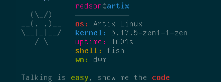

<h1 align="center"><code>ppfetch</code></h1>
<p align="center">ppfetch, but written in Rust.</p>
<p align="center">
  <a href="ppfetch-show.png">
    
  </a>
</p>

## 💡 **About**
The ppfetch was created to be a simple, basic, and posix fetch. Now, it's a simple, fast and written in Rust.

## 🚀 Setup

### 🧾 Dependencies

- [`sh`](https://en.wikipedia.org/wiki/Unix_shell)
- [`wmctrl`](https://www.freedesktop.org/wiki/Software/wmctrl/)
- [`Rust`](https://rust-lang.org/)

## 📥 **Installation**

#### 🔧 Manually

<!-- Option 1: using `curl` (release binary)
```sh
curl https://github.com/RedsonBr140/ppfetch-rs/releases/download/v1.1.0/ppfetch-rs > ~/.local/bin/ppfetch-rs
chmod +x ~/.local/bin/ppfetch-rs
```
(Make sure that you have `~/.local/bin` on your `$PATH`.)
-->
Option 1: Compiling from `source`:

```sh
git clone https://github.com/RedsonBr140/ppfetch-rs.git
cd ppfetch-rs
cargo build --release
cargo install --path .
```
(Make sure that you have `~/.cargo/bin` on your `$PATH`.)

> *If you can and want to port ppfetch-rs to any package manager, feel free to do so.*

## 📋 Todo
 - [ ] Remove uptime and implement packages count instead.
 - [ ] Port ppfetch-rs to AUR.

## 💌 **License**

MIT License

<p align="center">:heart: <code>Keep It Simple, Stupid.</code></p>

